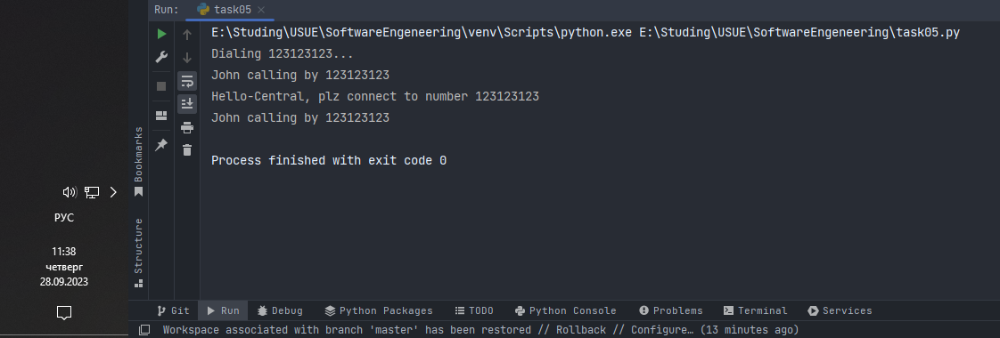

# Тема 2. Базовые операции языка Python
Отчет по Теме #2 выполнил(а):
- Дуркин Андрей Викторович
- ЗПИЭ-20-1

| Задание | Лаб_раб | Сам_раб |
| ------ |---------|---------|
| Задание 1 | -       | +       |
| Задание 2 | -       | +       |
| Задание 3 | -       | +       |
| Задание 4 | -       | +       |
| Задание 5 | -       | +       |
| Задание 6 | -       | +       |
| Задание 7 | -       | +       |
| Задание 8 | -       | +       |
| Задание 9 | -       | +       |
| Задание 10 | -       | +       |

знак "+" - задание выполнено; знак "-" - задание не выполнено;

Работу проверили:
- к.э.н., доцент Панов М.А.

## Самостоятельная  работа №1
### Выведите в консоль булевую переменную False, не используя слово False в строке или изначально присвоенную булевую переменную. Программа должна занимать не более двух строк редактора кода.
```python
print(2 == 1)
```
### Результат.


## Выводы

В данной задаче я научился практическому применению функции print() для вывода в консоль значений 

## Самостоятельная работа №2
### Присвоить значения трем переменным и вывести их в консоль, используя только две строки редактора кода

```python
a, b, c = 1, True, "c"
print(a, b, c)
```

### Результат.


## Выводы
в данной задаче я применил полученные знания об групповой инициализации переменных и выводе их в консоль

## Самостоятельная работа №3
### Реализуйте ввод данных в программу, через консоль, в виде только целых чисел (тип данных int). То есть при вводе буквенных символов в консоль, программа не должна работать. Программа должна занимать не более двух строк редактора кода.

```python
x = int(input("input any integer: "))
```

### Результат.


## Выводы
в данной задаче я практически проверил возможность конвертации различных значений полученных из консоли к целочисленному типу 
  
## Самостоятельная работа №4
### Создайте только одну строковую переменную. Длина строки должна не превышать 5 символов. На выходе мы должны получить строку длиной не менее 16 символов. Программа должна занимать не более двух строк редактора кода.

```python
someString = 'word'
print(someString * (1 + 16 // len(someString)))
```

### Результат.


## Выводы

В данной работе я применил на практике полученные знания об операциях со строками и математических операциях  

## Самостоятельная работа №5
### Создайте три переменные: день (тип данных - числовой), месяц (тип данных - строка), год (тип данных - числовой) и выведите в консоль текущую дату в формате: “Сегодня день месяц год. Всего хорошего!” используя F строку и оператор end внутри print(), в котором вы должны написать фразу “Всего хорошего!”. Программа должна занимать не более двух строк редактора кода.

```python
day, month, year = 23, "сентября", 2023
print(f"Сегодня {day} {month} {year}. ", end="Всего хорошего!")
```

### Результат.


## Выводы

В данной работе я применил на практике полученные знания о f-строках и дополнительных параметрах функции print()

## Самостоятельная работа №6
### В предложении ‘Hello World’ вставьте ‘my’ между двумя словами. Выведите полученное предложение в консоль в одну строку. Программа должна занимать не более двух строк редактора кода.

```python
a = "Hello world"
print(a.replace(" ", " my "))
```

### Результат.


## Выводы

В данной работе я применил на практике полученные знания о методе replace() строкового типа 

## Самостоятельная работа №7
### Узнайте длину предложения ‘Hello World’, результат выведите в консоль. Программа должна занимать не более двух строк редактора кода.

```python
a = "Hello World"
print(len(a))
```

### Результат.


## Выводы

В данной работе я применил на практике полученные знания о функции len() осуществляющей подсчет элементов в контейнере, коим является в нашем примере строка.

## Самостоятельная работа №8
### Переведите предложение ‘HELLO WORLD’ в нижний регистр. Программа должна занимать не более двух строк редактора кода.

```python
a = "HELLO WORLD"
print(a.lower())
```

### Результат.


## Выводы

В данной работе я применил на практике полученные знания о методе lower() строкового типа, выполняющего перевод строки в нижний регистр 

## Самостоятельная работа №9
### Самостоятельно придумайте задачу по проходимой теме и решите ее. Задача должна быть связанна со взаимодействием с числовыми значениями.

### Задача
Инициализируйте и возведите в степень 2 целочисленных переменных (например x1 в степени x2) результат выведите в консоль.

```python
x1, x2 = 2, 10
print(2 ** 10)
```

### Результат.


## Выводы

В данной работе я применил на практике полученные знания о функции print(), а также выполнил математические операции 

## Самостоятельная работа №10
### Самостоятельно придумайте задачу по проходимой теме и решите ее. Задача должна быть связанна со взаимодействием со строковыми значениями.

### Задача
Выведите в консоль два слова разделенных запятой

```python
s1, s2 = "Hello", "world"
print(s1, s2, sep=", ")
```

### Результат.


## Выводы

В данной работе я применил на практике полученные знания о функции print() и её дополнительных параметрах

## Общие выводы по теме
- В данной теме мы получили практические навыки и знания о базовых возможностях языка python, включая некоторые функции, типы, способы написания простейших программ.

