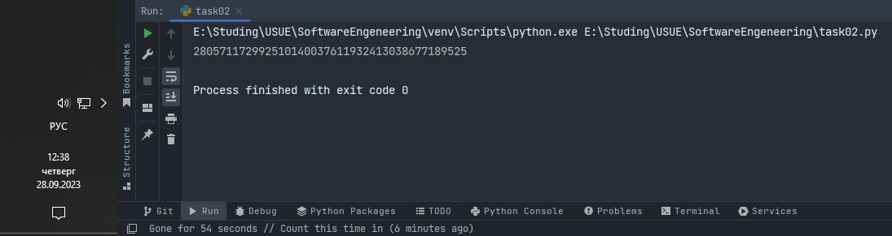
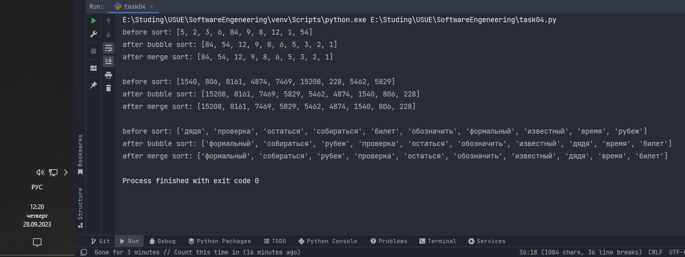

# Тема 3. Операторы, условия, циклы
Отчет по Теме #3 выполнил(а):
- Дуркин Андрей Викторович
- ЗПИЭ-20-1

| Задание | Лаб_раб | Сам_раб |
| ------ |---------|---------|
| Задание 1 | -       | +       |
| Задание 2 | -       | +       |
| Задание 3 | -       | +       |
| Задание 4 | -       | +       |
| Задание 5 | -       | +       |

знак "+" - задание выполнено; знак "-" - задание не выполнено;

Работу проверили:
- к.э.н., доцент Панов М.А.

## Самостоятельная  работа №1
### Напишите программу, которая преобразует 1 в 31.

```python
one = 1
for i in range(2):
    one *= 5
    one += 1
print(one)
```
### Результат.


## Выводы

В данной задаче я освоил применение циклов и сокращенной записи операции присвоения объединенной с другой арифметической операцией 

## Самостоятельная работа №2
### Напишите программу, которая фразу «Hello World» выводит в обратном порядке, и каждая буква находится в одной строке консоли.

```python
st = "Hello World"
for i in range(len(st)):
    print(st[len(st) - i - 1])
```


## Выводы
в данной задаче я продолжил освоение работы с циклами и строковыми переменными

## Самостоятельная работа №3
### Напишите программу, на вход которой поступает значение из консоли, оно должно быть числовым и в диапазоне от 0 до 10 включительно (это необходимо учесть в программе). Если вводимое число не подходит по требованиям, то необходимо вывести оповещение об этом в консоль и остановить программу. Код должен вычислять в каком диапазоне находится полученное число.

```python
x = int(input("Enter integer in range [0,10]: "))
if 0 <= x <= 10:
    print("от 0 до 3 включительно" if x <= 3 else "от 3 до 6 " if x < 6 else "от 6 до 10 включительно")
else:
    print("Integer must be in range [0,10]")
```

### Результат.


## Выводы
в данной задаче я освоил работу с условными операторами, в том числе с тернарными операторами
  
## Самостоятельная работа №4
### Манипулирование строками. Напишите программу на Python, которая принимает предложение (на английском) в качестве входных данных от пользователя. Выполните следующие операции и отобразите результаты:
### - Выведите длину предложения.
### - Переведите предложение в нижний регистр.
### - Подсчитайте количество гласных (a, e, i, o, u) в предложении.
### - Замените все слова "ugly" на "beauty".
### - Проверьте, начинается ли предложение с "The" и заканчивается ли на "end".
### Проверьте работу программы минимум на 3 предложениях, чтобы охватить проверку всех поставленных условий.


### Тестовые данные 
1. The ugly of a flower lies in its scent, not in its end
2. The ugly of the ocean is in its mysterious ugly, waiting to be explored
3. beauty of life is in the uniqueness of each individual, embracing differences instead of judging

```python
sentence = input("enter your sentence: ")
print("length of sentence is " + str(len(sentence)) + " characters")
print(f"sequence in lower case: {sentence.lower()}")
vowels = ('a', 'e', 'i', 'o', 'u')
count = 0
for c in vowels:
    count += sentence.count(c)
print(f"Amount of vowel letters is: {count}")
print(f"'Ugly' to 'beauty' replace result: {sentence.replace('ugly', 'beauty')}")
print(f"Begin with 'the' = {sentence.startswith('The')}")
print(f"End with 'end' = {sentence.endswith('end')}")
```

### Результат.



## Выводы

В данной работе я применил на практике полученные знания об операциях со строками, такими как:
проверка на совпадение произвольной строки с началом или концом другой строки, подсчет длины строки, а так же продолжил освоение работы с циклами

## Самостоятельная работа №5
### Составьте программу, результатом которой будет данный вывод в консоль:

### Программу нужно составить из данных фрагментов кода:

### Строки кода можно использовать только один раз.Не обязательно использовать все строки кода

```python
string = 'hello'
counter = 0
values = [0, 2, 4, 6, 8, 10]
while counter != 10:
    memory = string
    if counter in values:
        string = string + ' world'
    print(string)
    counter += 1
    string = memory
memory = ' world'
print(string + memory)
```

### Результат.


## Выводы

В данной работе я применил на практике ум и сообразительность, и освоил импровизированную систему low-code, собрав работающую программу из имеющихся программных блоков

## Общие выводы по теме
- В данной теме мы получили знания и практические навыки по использованию в языке питон циклов, условных операторов, циклов, а также расширили спектр доступного инструментария


