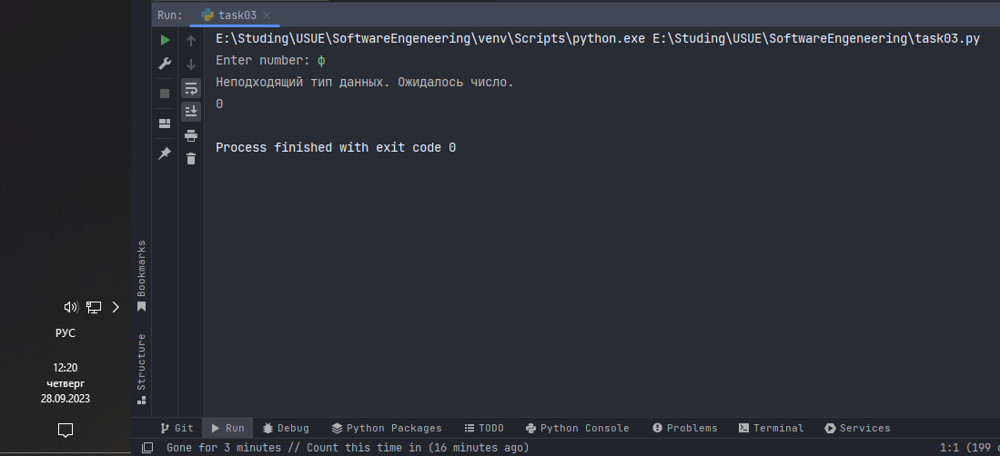
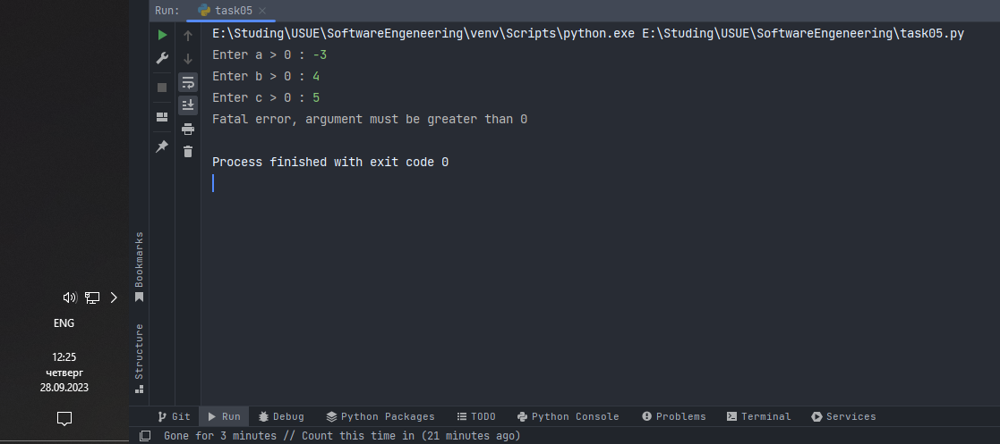

# Тема 4. Функции и стандартные модули/библиотеки
Отчет по Теме #4 выполнил(а):
- Дуркин Андрей Викторович
- ЗПИЭ-20-1

| Задание | Лаб_раб | Сам_раб |
| ------ |---------|---------|
| Задание 1 | -       | +       |
| Задание 2 | -       | +       |
| Задание 3 | -       | +       |
| Задание 4 | -       | +       |
| Задание 5 | -       | +       |

знак "+" - задание выполнено; знак "-" - задание не выполнено;

Работу проверили:
- к.э.н., доцент Панов М.А.

## Самостоятельная  работа №1
### Дайте подробный комментарий для кода, написанного ниже. Комментарий нужен для каждой строчки кода, нужно описать что она делает. Не забудь те, что функции комментируются по-особенному.

```python
# Импортируем класс datetime из модуля datetime
from datetime import datetime
# Импортируем функцию sqrt из модуля math
from math import sqrt


# объявление функции
def main(**kwargs):
    """
    Функция вычисляет (предположительно) длину гипотенузы и
    выводит на печать результат по произвольному количеству пар чисел
    """
    # итерируемся по словарю
    for key in kwargs.items():
        # вычисляем результат
        result = sqrt(key[1][0] ** 2 + key[1][1] ** 2)
        # выводим в консоль полученный результат
        print(result)


# проверяем запускается модуль напрямую или импортируется
if __name__ == '__main__':
    # фиксируем время начала выполнения
    start_time = datetime.now()
    # вызываем функцию main() и передаем аргументы
    main(
        one=[10, 3],
        two=[5, 4],
        three=[15, 13],
        four=[93, 53],
        five=[133, 15]
    )
    # фиксируем время окончания выполнения функции и считаем дельту
    timecost = datetime.now() - start_time
    # выводим в консоль получившееся время выполнения
    print(f"Время выполнения программы - {timecost}")

```
### Результат.


## Выводы

В данной задаче я произвел анализ чужого кода и получил навык анализа кода. Также освоил написание комментариев к коду.

## Самостоятельная работа №2
### Напишите программу, которая будет заменять игральную кость с 6 гранями. Если значение равно 5 или 6, то в консоль выводится «Вы победили», если значения 3 или 4, то вы рекурсивно должны вызвать эту же функцию, если значение 1 или 2, то в консоль выводится «Вы проиграли». При этом каждый вызов функции необходимо выводить в консоль значение “кубика”. Для выполнения задания необходимо использовать стандартную библиотеку random. Программу нужно написать, используя одну функцию и "точку входа".

```python
st = "Hello World"
import random


def roll_dice():
    dice = random.randint(1, 6)
    print(f"Выпало - {dice}")
    if dice == 5 or dice == 6:
        print("Вы выиграли")
    elif dice == 1 or dice == 2:
        print("Вы проиграли")
    else:
        print("Переигрываем")
        roll_dice()


if __name__ == '__main__':
    roll_dice()

```


## Выводы
в данной задаче я освоил и применил использование стандартной библиотеки random, освоил написание собственных функций, использовал рекурсивный вызов функции

## Самостоятельная работа №3
### Напишите программу, которая будет выводить текущее время, с точностью до секунд на протяжении 5 секунд. Программу нужно написать с использованием цикла. Подсказка: необходимо использовать модуль datetime и time, а также вам необходимо как-то “усыплять” программу на 1 секунду.

```python
from datetime import datetime
import time

for i in range(5):
    print("Current Time =", datetime.now().strftime("%H:%M:%S"))
    time.sleep(1)
```

### Результат.



## Выводы
в данной задаче я освоил работу со стандартными библиотеками datetime и time.
  
## Самостоятельная работа №4
### Напишите программу, которая считает среднее арифметическое от аргументов вызываемое функции, с условием того, что изначальное количество этих аргументов неизвестно. Программу необходимо реализовать используя одну функцию и “точку входа”.

```python
def average(*numbers):
    total = 0
    for i in numbers:
        total += i
    return total / len(numbers)


if __name__ == '__main__':
    result = average(1, 2, 3, 4, 5, 6)
    print(f"Average is {result}")

```

### Результат.


## Выводы

В данной работе я освоил реализацию функций с произвольным количеством входящих аргументов. 

## Самостоятельная работа №5
### Создайте два Python файла, в одном будет выполняться вычисление площади треугольника при помощи формулы Герона (необходимо реализовать через функцию), а во втором будет происходить взаимодействие с пользователем (получение всей необходимой информации и вывод результатов). Напишите эту программу и выведите в консоль полученную площадь.

- geron.py
```python
#geron.py
def square_triangle(a, b, c):
    p = (a + b + c) / 2
    return (p * (p - a) * (p - b) * (p - c)) ** 0.5

```
- task05.py
```python
#task05.py
from geron import square_triangle

a = int(input("Enter a > 0 :"))
b = int(input("Enter b > 0 :"))
c = int(input("Enter c > 0 :"))

if a <= 0 or b <= 0 or c <= 0:
    print("fatal error, argument must be greater than 0")
elif a + b < c or a + c < b or b + c > a:
    print("fatal error, there's not triangle")
else:
    square = square_triangle(a, b, c)
    print(f"Square of triangle is {round(square, 3)}")

```

### Результат.




## Выводы

В данной работе я освоил создание и использование внешних библиотек и функций. Это позволяет разделять логические блоки программы, делая приложение модульным.

## Общие выводы по теме
- В данной теме мы получили знания и практические навыки по использованию внешних модулей и функций языка питон.


