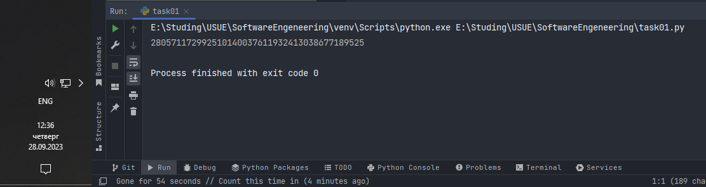

# Тема 5. Базовые коллекции: множества, списки
Отчет по Теме #5 выполнил(а):
- Дуркин Андрей Викторович
- ЗПИЭ-20-1

| Задание | Лаб_раб | Сам_раб |
| ------ |---------|---------|
| Задание 1 | -       | +       |
| Задание 2 | -       | +       |
| Задание 3 | -       | +       |
| Задание 4 | -       | +       |
| Задание 5 | -       | +       |

знак "+" - задание выполнено; знак "-" - задание не выполнено;

Работу проверили:
- к.э.н., доцент Панов М.А.

## Самостоятельная  работа №1
### Ресторан на предприятии ведет учет посещений за неделю при помощи кода работника. У них есть список со всеми посещениями за неделю. 
### Ваша задача почитать:
### • Сколько было выдано чеков
### • Сколько разных людей посетило ресторан
### • Какой работник посетил ресторан больше всех раз 
### Список выданных чеков за неделю:
### [8734, 2345, 8201, 6621, 9999, 1234, 5678, 8201, 8888, 4321, 3365, 1478, 9865, 5555, 7777, 9998, 1111, 2222, 3333, 4444, 5556, 6666, 5410, 7778, 8889, 4445, 1439, 9604, 8201, 3365, 7502, 3016, 4928, 5837, 8201, 2643, 5017, 9682, 8530, 3250, 7193, 9051, 4506, 1987, 3365, 5410, 7168, 7777, 9865, 5678, 8201, 4445, 3016, 4506, 4506]
### Результатом выполнения задачи будет: листинг кода, и вывод в консоль, в котором будет указана вся необходимая информация.

```python
checks = [8734, 2345, 8201, 6621, 9999, 1234, 5678, 8201, 8888, 4321, 3365, 1478,
          9865, 5555, 7777, 9998, 1111, 2222, 3333, 4444, 5556, 6666, 5410, 7778,
          8889, 4445, 1439, 9604, 8201, 3365, 7502, 3016, 4928, 5837, 8201, 2643,
          5017, 9682, 8530, 3250, 7193, 9051, 4506, 1987, 3365, 5410, 7168, 7777,
          9865, 5678, 8201, 4445, 3016, 4506, 4506]
checkAmount = len(checks)
print(f"Выдано чеков - {checkAmount} шт")
menCount = len(dict.fromkeys(checks))
print(f"Количество разных людей посетивших ресторан - {menCount}")
maxVisitsCode = max(set(checks), key=checks.count)
print(f"Работник больше всех посетивший ресторан - {maxVisitsCode}")
```
### Результат.


## Выводы

В данной работе я изучил и применил методы работы с базовыми коллекциями языка питон: списком, словарем, множеством.

## Самостоятельная работа №2
### На физкультуре студенты сдавали бег, у преподавателя физкультуры есть список всех результатов, ему нужно узнать
### - Три лучшие результата
### - Три худшие результата
### - Все результаты начиная с 10
### Ваша задача помочь ему в этом. Список результатов бега:
### [10.2, 14.8, 19.3, 22.7, 12.5, 33.1, 38.9, 21.6, 26.4, 17.1, 30.2, 35.7, 16.9, 27.8, 24.5, 16.3, 18.7, 31.9, 12.9, 37.4]
### Результатом выполнения задачи будет: листинг кода, и вывод в консоль, в котором будет указана вся необходимая информация.

```python
results = [10.2, 14.8, 19.3, 22.7, 12.5, 33.1, 38.9, 21.6, 26.4, 17.1,
           30.2, 35.7, 16.9, 27.8, 24.5, 16.3, 18.7, 31.9, 12.9, 37.4]
three_best = sorted(results, reverse=False)[:3]
print(f"Три лучшие результата - {three_best}")
three_worse = sorted(results, reverse=True)[:3]
print(f"Три худшие результата - {three_worse}")
more_than_ten = [x for x in results if x >= 10]
print(f"Все результаты начиная с 10 - {more_than_ten}")
```

### Результат.


## Выводы
в данной работе я освоил и применил методы работы с коллекциями, в том числе сортировку и слайсинг

## Самостоятельная работа №3
### Преподаватель по математике придумал странную задачку. У вас есть три списка с элементами, каждый элемент которых – длина стороны треугольника, ваша задача найти площади двух треугольников, составленные из максимальных и минимальных элементов полученных списков. Результатом выполнения задачи будет: листинг кода, и вывод в консоль, в котором будут указаны два этих значения. Три списка:
### one = [12, 25, 3, 48, 71]
### two = [5, 18, 40, 62, 98]
### three = [4, 21, 37, 56, 84]

- task03.py
```python
#task03.py
from geron import square_triangle

one = [12, 25, 3, 48, 71]
two = [5, 18, 40, 62, 98]
three = [4, 21, 37, 56, 84]

maxTriangle = square_triangle(max(one), max(two), max(three))
minTriangle = square_triangle(min(one), min(two), min(three))
print(f"Triangle with max size square is {maxTriangle}")
print(f"Triangle with min size square is {minTriangle}")
```
- geron.py
```python
#geron.py
def square_triangle(a, b, c):
    p = (a + b + c) / 2
    s = (p * (p - a) * (p - b) * (p - c)) ** 0.5
    return s
```

### Результат.


## Выводы
в данной задаче я освоил работу со стандартными коллекциями и применил ранее полученные знания по работе с библиотеками
  
## Самостоятельная работа №4
### Никто не любит получать плохие оценки, поэтому Борис решил это исправить. Допустим, что все оценки студента за семестр хранятся в одном списке. Ваша задача удалить из этого списка все двойки, а все тройки заменить на четверки. Списки оценок (проверить работу программы на всех трех вариантах):
### [2, 3, 4, 5, 3, 4, 5, 2, 2, 5, 3, 4, 3, 5, 4]
### [4, 2, 3, 5, 3, 5, 4, 2, 2, 5, 4, 3, 5, 3, 4]
### [5, 4, 3, 3, 4, 3, 3, 5, 5, 3, 3, 3, 3, 4, 4]
### Результатом выполнения задачи будет: листинг кода, и вывод в консоль, в котором будут три обновленных массива.

```python
variants = [[2, 3, 4, 5, 3, 4, 5, 2, 2, 5, 3, 4, 3, 5, 4],
            [4, 2, 3, 5, 3, 5, 4, 2, 2, 5, 4, 3, 5, 3, 4],
            [5, 4, 3, 3, 4, 3, 3, 5, 5, 3, 3, 3, 3, 4, 4]]
for rates in variants:
    rates = [e for e in rates if e != 2]
    rates = [4 if e == 3 else e for e in rates]
    print(rates)
```

### Результат.


## Выводы

В данной работе я освоил и применил дополнительные способы работы с коллекциями.

## Самостоятельная работа №5
### Вам предоставлены списки натуральных чисел, из них необходимо сформировать множества. При этом следует соблюдать это правило: если какое-либо число повторяется, то преобразовать его в строку по следующему образцу: например, если число 4 повторяется 3 раза, то в множестве будет следующая запись: само число 4, строка «44», строка «444». 
### Множества для теста:
### list_1 = [1, 1, 3, 3, 1]
### list_2 = [5, 5, 5, 5, 5, 5, 5]
### list_3 = [2, 2, 1, 2, 2, 5, 6, 7, 1, 3, 2, 2]
### Результаты вывода (порядок может отличаться, поскольку мы работаем с set()):
### {'11', 1, 3, '33', '111'}
### {5, '5555', '555555', '55555', '555', '55', '5555555'}
### {'11', 1, 3, 2, 5, 6, '222222', '222', 7, '2222', '22222', '22'}

```python
def create_set(input_list):
    result = set()
    for e in input_list:
        el = e
        while True:
            if el in result:
                el = str(el) + str(e)
            else:
                result.add(el)
                break
    return result


list_1 = [1, 1, 3, 3, 1]
list_2 = [5, 5, 5, 5, 5, 5, 5]
list_3 = [2, 2, 1, 2, 2, 5, 6, 7, 1, 3, 2, 2]

print(create_set(list_1))
print(create_set(list_2))
print(create_set(list_3))
```

### Результат.


## Выводы

В данной работе я продолжил осваивать методы работы с коллекциями список и множество

## Общие выводы по теме
- В данной теме мы получили знания и практические навыки по работе со стандартными коллекциями языка питон, такими как список, множество и методами работы с ними 


