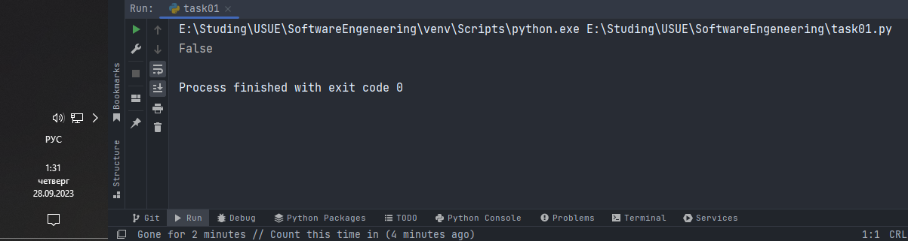
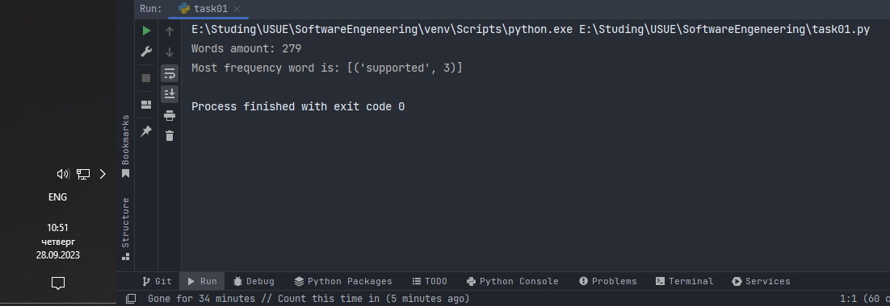
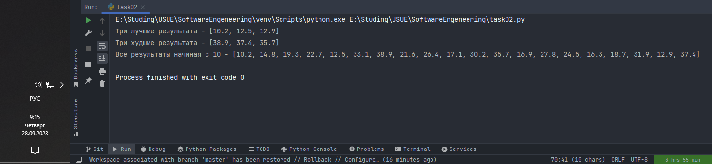
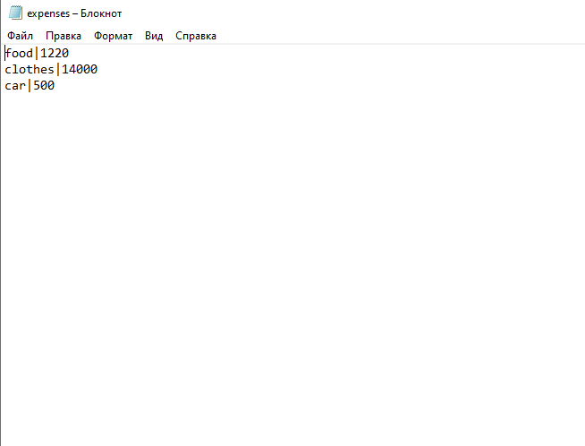
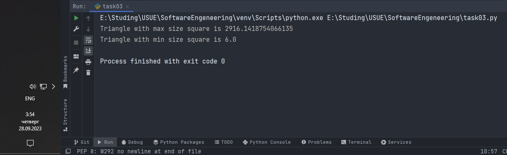
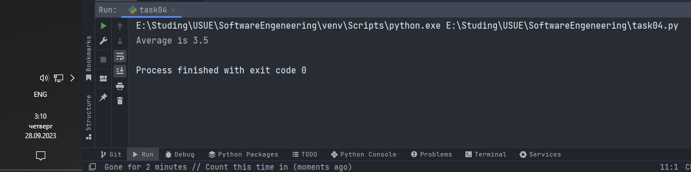
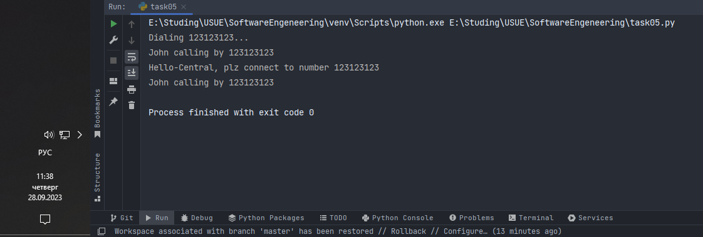
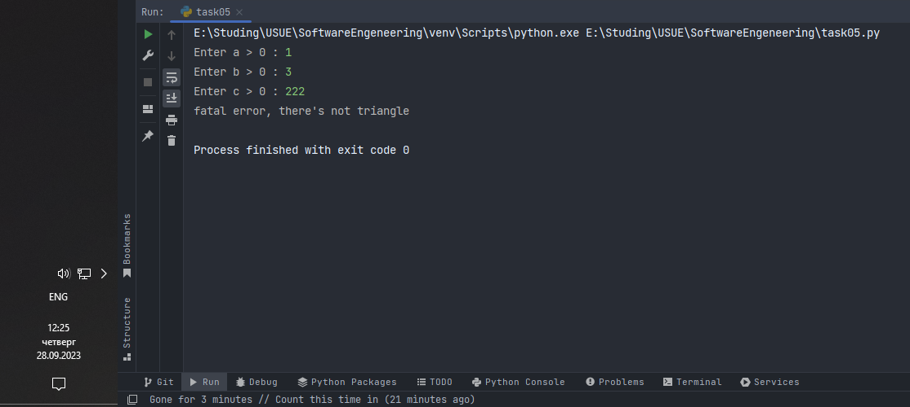

# Тема 7. Работа с файлами (ввод, вывод)
Отчет по Теме #7 выполнил(а):
- Дуркин Андрей Викторович
- ЗПИЭ-20-1

| Задание | Лаб_раб | Сам_раб |
| ------ |---------|---------|
| Задание 1 | -       | +       |
| Задание 2 | -       | +       |
| Задание 3 | -       | +       |
| Задание 4 | -       | +       |
| Задание 5 | -       | +       |

знак "+" - задание выполнено; знак "-" - задание не выполнено;

Работу проверили:
- к.э.н., доцент Панов М.А.

## Самостоятельная  работа №1
### Найдите в интернете любую статью (объем статьи не менее 200 слов), скопируйте ее содержимое в файл и напишите программу, которая считает количество слов в текстовом файле и определит самое часто встречающееся слово. Результатом выполнения задачи будет: скриншот файла со статьей, листинг кода, и вывод в консоль, в котором будет указана вся необходимая информация.

### Исходный файл.


```python
import collections
import re


def get_top_frequency(w_list):
    result_dic = collections.OrderedDict([])
    for word in w_list:
        result_dic[word] = result_dic.get(word, 0) + 1
    return sorted(result_dic.items(), key=lambda item: item[1], reverse=True)[:1]


words_list = []
with open('files/article.txt') as input_file:
    for line in input_file:
        words_list.extend(re.findall("[a-zA-Z_]+", line))
print(f"Words amount: {len(words_list)}")
print(f"Most frequency word is: {get_top_frequency(words_list)}")
```
### Результат.


## Выводы

В данной работе я познакомился с работой с файлами, считал информацию из файла и произвел анализ полученного текста

## Самостоятельная работа №2
### У вас появилась потребность в ведении книги расходов, посмотрев все существующие варианты вы пришли к выводу что вас ничего не устраивает и нужно все делать самому. Напишите программу для учета расходов. Программа должна позволять вводить информацию о расходах, сохранять ее в файл и выводить существующие данные в консоль. Ввод информации происходит через консоль. Результатом выполнения задачи будет: скриншот файла с учетом расходов, листинг кода, и вывод в консоль, с демонстрацией работоспособности программы.

```python
while True:
    article = input('Enter article of expenses: ')
    expenses = input('Enter expenses (sum): ')
    file = open('files/expenses.txt', 'a')
    file.write(article + '|' + expenses + '\n')
    file.close()
    proceed = input("Do u want enter another expenses y/n?")
    if proceed.lower() == 'n':
        break
```

### Результат.



## Выводы
в данной работе я освоил и применил методы работы с файлами, произвел добавление информации в файл и его сохранение

## Самостоятельная работа №3
### Имеется файл input.txt с текстом на латинице. Напишите программу, которая выводит следующую статистику по тексту: 
### Количество букв латинского алфавита; число слов; число строк.
### • Текст в файле:
### Beautiful is better than ugly.
### Explicit is better than implicit.
### Simple is better than complex.
### Complex is better than complicated.
### • Ожидаемый результат:
### Input file contains:
### 108 letters
### 20 words
### 4 lines

```python
import re

lines, words, letters = 0, 0, 0
with open('files/latin_text.txt') as input_file:
    for line in input_file:
        lines += 1
        words_list = re.findall("[a-zA-Z_]+", line)
        words += len(words_list)
        letters += sum(len(word) for word in words_list)

print("Input file contains:")
print(f"{letters} letters")
print(f"{words} words")
print(f"{lines} lines")
```

### Результат.


## Выводы
в данной задаче я применил полученные ранее знания для сбора статистики по тексту из текстового файла
  
## Самостоятельная работа №4
### Напишите программу, которая получает на вход предложение, выводит его в терминал, заменяя все запрещенные слова звездочками * (количество звездочек равно количеству букв в слове). Запрещенные слова, разделенные символом пробела, хранятся в текстовом файле input.txt. Все слова в этом файле записаны в нижнем регистре. Программа должна заменить запрещенные слова, где бы они ни встречались, даже в середине другого слова. Замена производится независимо от регистра: 

```python
test_sequence = "Hello, world! Python IS the programming language of thE future. My EMAIL is… PYTHON is awesome!!!!"


def remove_bad_words(sequence):
    with open('files/input.txt') as input_file:
        bad_words = input_file.readline().split()
        for bad_word in bad_words:
            while True:
                bad_index = sequence.lower().find(bad_word)
                if bad_index == -1:
                    break
                word_len = len(bad_word)
                sequence = sequence[:bad_index] + '*' * word_len + sequence[bad_index + word_len:]
    return sequence


if __name__ == '__main__':
    print(remove_bad_words(test_sequence))
```

### Результат.


## Выводы

В данной работе я применил практические навыки по работе с файлами и коллекциями

## Самостоятельная работа №5
### Самостоятельно придумайте и решите задачу, которая будет взаимодействовать с текстовым файлом.

### Задача
### Используя фильтр плохих слов из работы №4, измените то же предложение и сохраните его в файл censored.txt

```python
from task04 import remove_bad_words


test_sequence = "Hello, world! Python IS the programming language of thE future. My EMAIL is… PYTHON is awesome!!!!"

if __name__ == '__main__':
    censored_text = remove_bad_words(test_sequence)
    with open('files/censored.txt', 'w') as file:
        file.write(censored_text)
```

### Результат.




## Выводы

В данной работе я произвел сохранение результата работы функции в новый файл

## Общие выводы по теме
- В данной теме мы получили знания и практические навыки по работе с файлами. Научились считывать информацию построчно и записывать необходимую информацию в файлы. Дополнительно отточили мастерство в применении навыков полученных в ранее пройденных темах 


