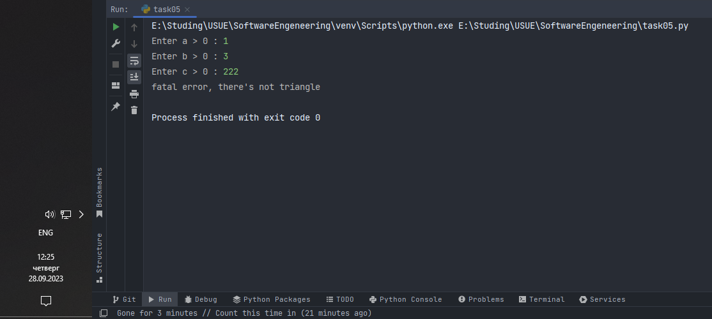

# Тема 10.  Декораторы и исключения
Отчет по Теме #10 выполнил(а):
- Дуркин Андрей Викторович
- ЗПИЭ-20-1

| Задание | Лаб_раб | Сам_раб |
| ------ |---------|---------|
| Задание 1 | -       | +       |
| Задание 2 | -       | +       |
| Задание 3 | -       | +       |
| Задание 4 | -       | +       |
| Задание 5 | -       | +       |

знак "+" - задание выполнено; знак "-" - задание не выполнено;

Работу проверили:
- к.э.н., доцент Панов М.А.

## Самостоятельная  работа №1
### Вовочка решил заняться спортивным программированием на python, но для этого он должен знать за какое время выполняется его программа. Он решил, что для этого ему идеально подойдет декоратор для функции, который будет выяснять за какое время выполняется та или иная функция. Помогите Вовочке в его начинаниях и напишите такой декоратор.
### Подсказка: необходимо использовать модуль time
### Декоратор необходимо использовать для этой функции:
```python
def fibonacci():
    fib1 = fib2 = 1
    for i in range(2, 200):
        fib1, fib2 = fib2, fib1 + fib2
    print(fib2, end=' ')
if __name__ == '__main__':
    fibonacci()
```
### Результатом вашей работы будет листинг кода и скриншот консоли, в котором будет выполненная функция Фибоначчи и время выполнения программы.
### Также на этом примере можете посмотреть, что решение задач через рекурсию не всегда является хорошей идеей. Поскольку решение Фибоначчи для 100 с использованием рекурсии и без динамического программирования решается более десяти секунд, а решение точно такой же задачи, но через цикл for еще и для 200, занимает меньше 1 секунды.

```python
import time


def performance(func):
    def wrapper(*args, **kwarg):
        start = time.time()
        result = func(*args, **kwarg)
        print(f"\nВремя выполнения функции {func.__name__} - {(time.time() - start)} мс\n")
        return result
    return wrapper


@performance
def fibonacci():
    fib1 = fib2 = 1
    for i in range(2, 200):
        fib1, fib2 = fib2, fib1 + fib2
    print(fib2, end=' ')


if __name__ == '__main__':
    fibonacci()
```
### Результат.


## Выводы

В данной работе я создал декоратор измеряющий время выполнения функции и применил его к имеющейся функции.
Также оценил что рекурсия зачастую является плохой практикой и возможны более быстрые решения, в том числе с использованием динмаического программирования 

## Самостоятельная работа №2
### Посмотрев на Вовочку, вы также загорелись идеей спортивного программирования, начав тренировки вы узнали, что для решения некоторых задач необходимо считывать данные из файлов. Но через некоторое время вы столкнулись с проблемой что файлы бывают пустыми, и вы не получаете вводные данные для решения задачи. После этого вы решили не просто считывать данные из файла, а всю конструкцию оборачивать в исключения, чтобы избежать такой проблемы. Создайте пустой файл и файл, в котором есть какая-то информация. Напишите код программы. Если файл пустой, то, нужно вызвать исключение (“бросить исключение”) и вывести в консоль “файл пустой”, а если он не пустой, то вывести информацию из файла.

```python
empty, non_empty = 'files/file_empty.txt', 'files/file_with_info.txt'


def read_file(name):
    with open(name, 'r') as file:
        try:
            import os
            if os.stat(name).st_size == 0:
                raise IOError()
            for line in file:
                print(line)
        except IOError:
            print("файл пустой")


read_file(empty)
read_file(non_empty)
```

### Результат.


## Выводы
в данной работе я применил дополнительный функционал для работы с файлами, научился бросать, перехватывать и обрабатывать исключения

## Самостоятельная работа №3 
### Напишите функцию, которая будет складывать 2 и введенное пользователем число, но если пользователь введет строку или другой неподходящий тип данных, то в консоль выведется ошибка “Неподходящий тип данных. Ожидалось число.”. Реализовать функционал программы необходимо через try/except и подобрать правильный тип исключения. Создавать собственное исключение нельзя. Проведите несколько тестов, в которых исключение вызывается и нет. Результатом выполнения задачи будет листинг кода и получившийся вывод в консоль

```python
def summary():
    try:
        x = int(input("Enter number: "))
        return 2 + x
    except ValueError:
        print("Неподходящий тип данных. Ожидалось число.")
    return 0


print(summary())
```

### Результат.


## Выводы
в данной задаче я продолжил исследовать возможности использования исключений, их перехвата и обработки
  
## Самостоятельная работа №4
### Создайте собственный декоратор, который будет использоваться для двух любых вами придуманных функций. Декораторы, которые использовались ранее в работе нельзя воссоздавать. Результатом выполнения задачи будет: класс декоратора, две как-то связанными с ним функциями, скриншот консоли с выполненной программой и подробные комментарии, которые будут описывать работу вашего кода. 

### Задача
Реализуйте функции сортировки пузырьком и слиянием. Реализуйте декоратор который будет возвращать результаты сортировки в обратном порядке

```python
test_list = [5, 2, 3, 6, 84, 9, 8, 12, 1, 54]
test_list2 = [1540, 806, 8161, 4874, 7469, 15208, 228, 5462, 5829]
test_list3 = ['дядя', 'проверка', 'остаться', 'собираться', 'билет', 'обозначить', 'формальный', 'известный', 'время',
              'рубеж']


def inverse_order(func):
    def wrapper(*args, **kwarg):
        result = func(*args, **kwarg)[::-1]
        return result
    return wrapper


@inverse_order
def bubble_sort(numbers):
    for i in range(len(numbers) - 1):
        for j in range(len(numbers) - i - 1):
            if numbers[j] > numbers[j + 1]:
                numbers[j], numbers[j + 1] = numbers[j + 1], numbers[j]
    return numbers


@inverse_order
def merge_sort(numbers):
    if len(numbers) > 1:
        mid = len(numbers) // 2
        left, right = numbers[:mid], numbers[mid:]
        merge_sort(left)
        merge_sort(right)
        i = j = k = 0
        while i < len(left) and j < len(right):
            if left[i] < right[j]:
                numbers[k] = left[i]
                i += 1
            else:
                numbers[k] = right[j]
                j += 1
            k += 1
        while i < len(left):
            numbers[k] = left[i]
            i += 1
            k += 1
        while j < len(right):
            numbers[k] = right[j]
            j += 1
            k += 1
    return numbers


print(f"before sort: {test_list}")
print(f"after bubble sort: {bubble_sort(test_list)}")
print(f"after merge sort: {merge_sort(test_list)}")
print()
print(f"before sort: {test_list2}")
print(f"after bubble sort: {bubble_sort(test_list2)}")
print(f"after merge sort: {merge_sort(test_list2)}")
print()
print(f"before sort: {test_list3}")
print(f"after bubble sort: {bubble_sort(test_list3)}")
print(f"after merge sort: {merge_sort(test_list3)}")
```

### Результат.


## Выводы
В данной работе я реализовал декоратор, обрабатывающий результаты работы функций реализующих методы сортировки пузырьком и слиянием

## Самостоятельная работа №5
### Создайте собственное исключение, которое будет использоваться в двух любых фрагментах кода. Исключения, которые использовались ранее в работе нельзя воссоздавать. Результатом выполнения задачи будет: класс исключения, код к котором в двух местах используется это исключение, скриншот консоли с выполненной программой и подробные комментарии, которые будут описывать работу вашего кода.

### Задача
Реализуйте расчет площади треугольника используя формулу Герона, при этом обработайте возможные ошибки при помощи собственного исключения. 

```python
def square_triangle(a, b, c):
    p = (a + b + c) / 2
    return (p * (p - a) * (p - b) * (p - c)) ** 0.5


class IllegalArgumentException(Exception):
    def __init__(self, message):
        self.message = message


a = int(input("Enter a > 0 : "))
b = int(input("Enter b > 0 : "))
c = int(input("Enter c > 0 : "))

try:
    if a <= 0 or b <= 0 or c <= 0:
        raise IllegalArgumentException("Fatal error, argument must be greater than 0")
    elif a + b < c or a + c < b or b + c < a:
        raise IllegalArgumentException("Fatal error, there's not triangle")
    else:
        square = square_triangle(a, b, c)
        print(f"Square of triangle is {round(square, 3)}")
except IllegalArgumentException as e:
    print(f"{e.message}")

```

### Результат.



## Выводы

в данной работе я успешно реализовал собственное исключение, и успешно применил его при обработке ошибок при расчете площади треугольника по формуле Герона

## Общие выводы по теме
- В данной теме мы познакомились с декораторами и исключениями, их реализацией в языке питон а так же успешно применили эти знания на практике


