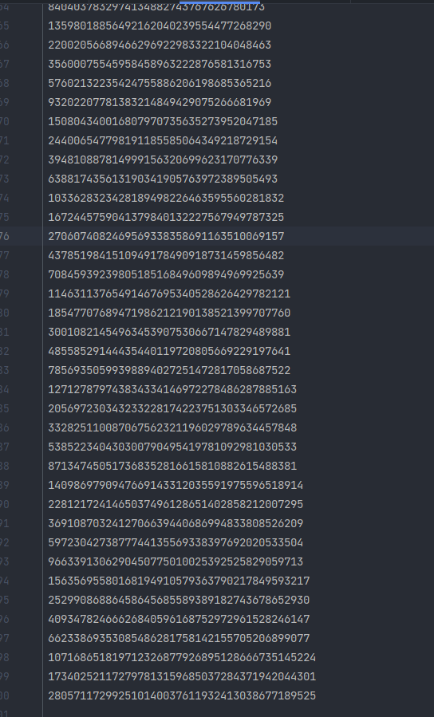

# Тема 11. Итераторы и генераторы
Отчет по Теме #11 выполнил(а):
- Дуркин Андрей Викторович
- ЗПИЭ-20-1

| Задание | Лаб_раб | Сам_раб |
| ------ |---------|---------|
| Задание 1 | -       | +       |
| Задание 2 | -       | +       |

знак "+" - задание выполнено; знак "-" - задание не выполнено;

Работу проверили:
- к.э.н., доцент Панов М.А.

## Самостоятельная  работа №1
### Вас никак не могут оставить числа Фибоначчи, очень уж они вас заинтересовали. Изучив новые возможности Python вы решили реализовать программу, которая считает числа Фибоначчи при помощи итераторов. Расчет начинается с чисел 1 и 1. Создайте функцию fib(n), генерирующую n чисел Фибоначчи с минимальными затратами ресурсов. Для реализации этой функции потребуется обратиться к инструкции yield (Она не сохраняет в оперативной памяти огромную последовательность, а дает возможность “доставать” промежуточные результаты по одному). Результатом решения задачи будет листинг кода и вывод в консоль с числом Фибоначчи от 200.

```python
def fibbonachi(n):
    f0 = 1
    yield f0
    f1 = 1
    yield f1
    for i in range(n - 2):
        f0, f1 = f1, f0 + f1
        yield f1


for num in fibbonachi(200):
    pass
print(num)
```
### Результат.


## Выводы

В данной работе я познакомился с итераторами и генераторами, а также применил их на примере расчета чисел Фиббоначи 

## Самостоятельная работа №2
### К коду предыдущей задачи добавьте запоминание каждого числа Фибоначчи в файл “fib.txt”, при этом каждое число должно находиться на отдельной строчке. Результатом выполнения задачи будет листинг кода и скриншот получившегося файла

```python
def fibbonachi(n):
    f0 = 1
    yield f0
    f1 = 1
    yield f1
    with open('fib.txt', 'a') as file:
        file.write(f"{f0}\n{f1}\n")
    for i in range(n - 2):
        f0, f1 = f1, f0 + f1
        with open('fib.txt', 'a') as file:
            file.write(f"{f1}\n")
        yield f1


for num in fibbonachi(200):
    pass
print(num)

```

### Результат.



## Выводы
в данной работе я применил дополнительный функционал для работы с файлами расширил функционал предыдущей задачи

## Общие выводы по теме
- В данной теме мы познакомились с итераторами и генераторами, оценили удобство и гибкость их использования.


